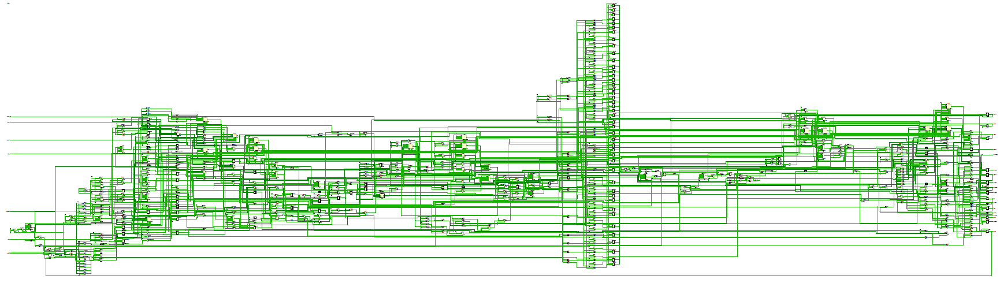
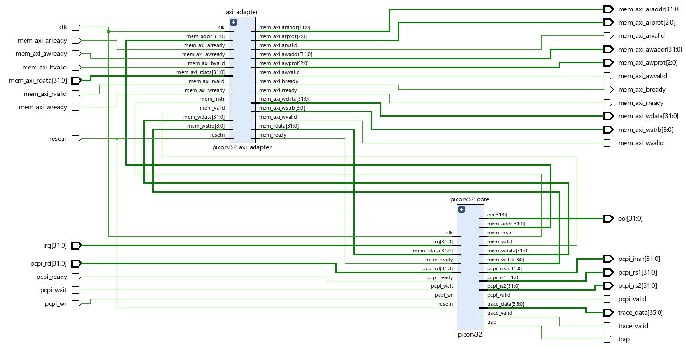
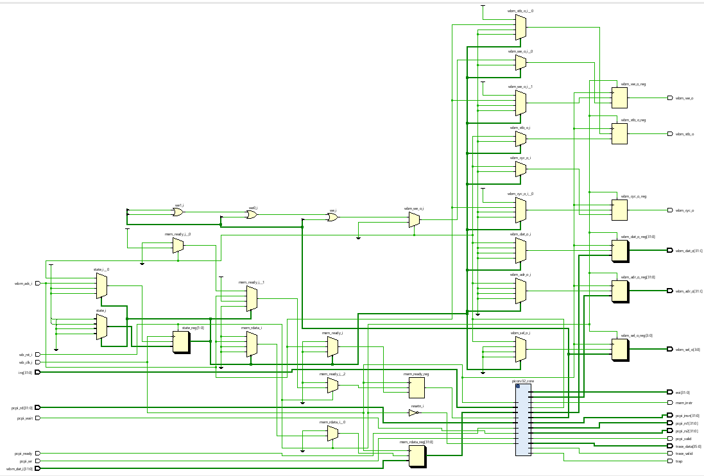
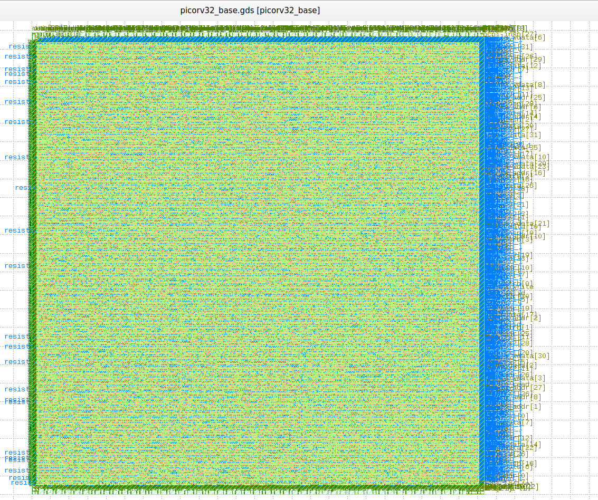

# [RISC-V-based-micro-controller-using-OpenLane](https://github.com/krutideepanpanda/RISC-V-based-micro-controller-using-OpenLane)

This project explores the highly customizable PicoRV32 and explores its various configurations.
I have tried running the base core enabled with PCPI, AXI version of the core with PCPI
and multiply module enabled, AXI version of the core with PCPI, multiply module, 2 clock
cycle ALU and 2 clock cycle compare enabled. We tried to fix errors and STA violations that occurred during our runs and tried to determine the highest possible clock frequency the core can run in the most stable manner possible.

​																							**Base core**

​																					**AXI Interface Enabled**

------

​																					**Wishbone Interface Enabled**

------

### Viewing GDSII using Klayout

